# ☁️ AWS Cloud Architecture Setup

This guide explains how DevOpsLab's cloud infrastructure was configured using AWS services to create a functional CI/CD experience.

## 🗂️ S3 - Frontend Hosting

**Bucket:**

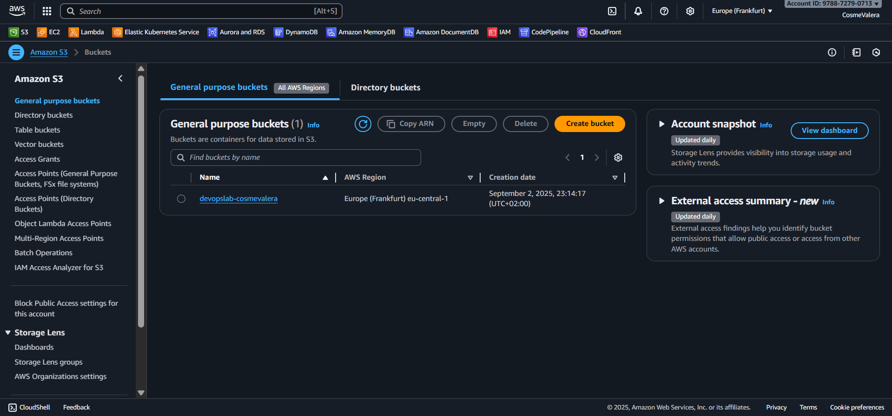

**Static Website Hosting:**
Configured S3 bucket to serve the React frontend as a static website.

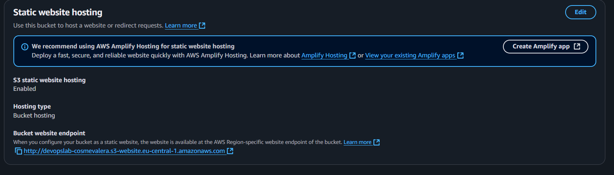

**CloudFront Integration:**
CloudFront CDN provides HTTPS support and global content delivery for the S3-hosted frontend.

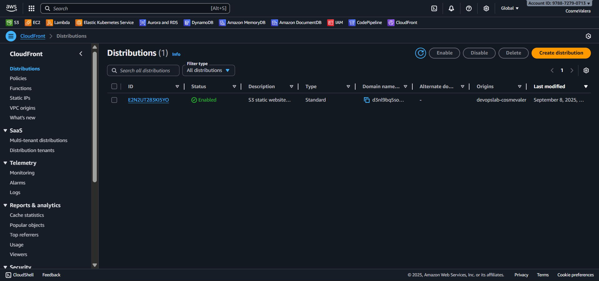

## 🔐 IAM - Access Management

**CLI User Setup:**
Created `cosme-cli` user for programmatic access to AWS services, enabling:
- EC2 SSH connections for Jenkins server management
- S3 deployment and content updates
- CloudFront cache invalidation to ensure fresh content delivery

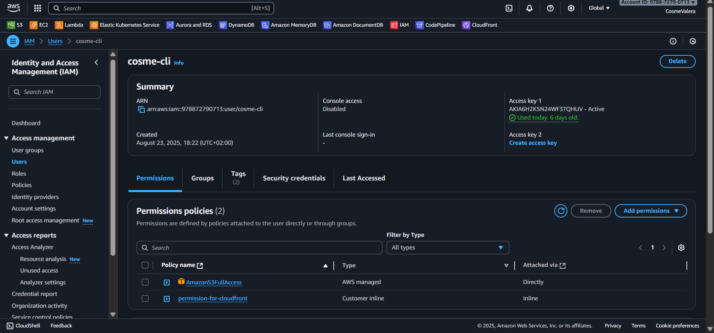

## ⚡ Lambda - API Backend

**Function Implementation:**
Lambda function handles API calls from the frontend to retrieve Jenkins pipeline status in real-time.

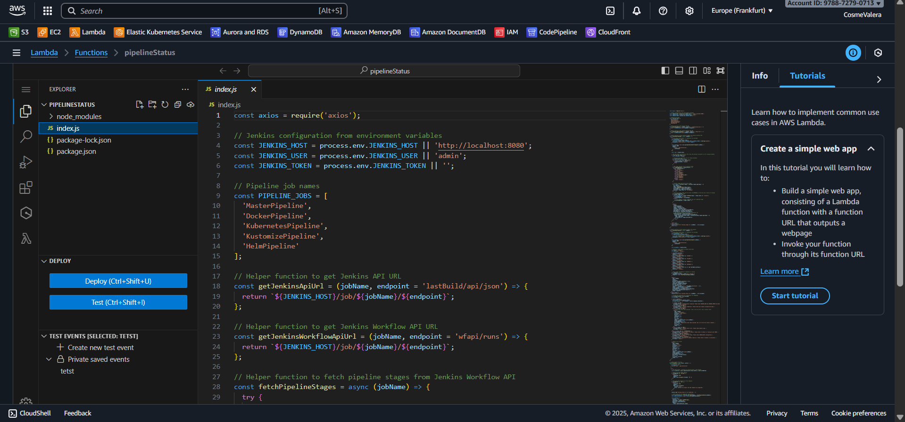

**Monitoring Dashboard:**
Track function performance, invocations, and error rates.

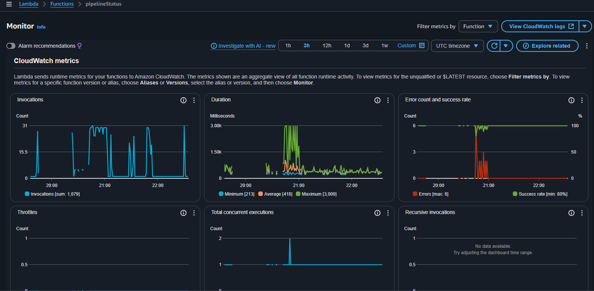

## 🖥️ EC2 - Jenkins Server

**Instance Overview:**
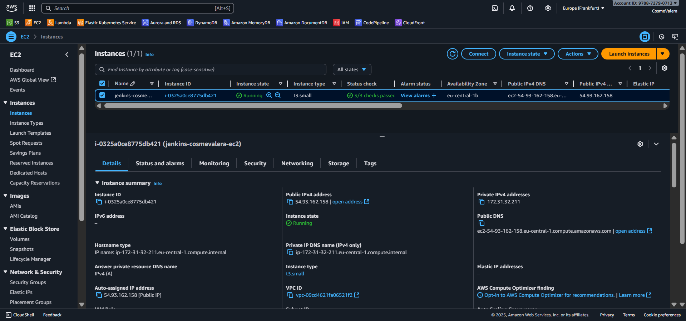

**SSH Access:**
Connect to EC2 instance via WSL using PEM key authentication:

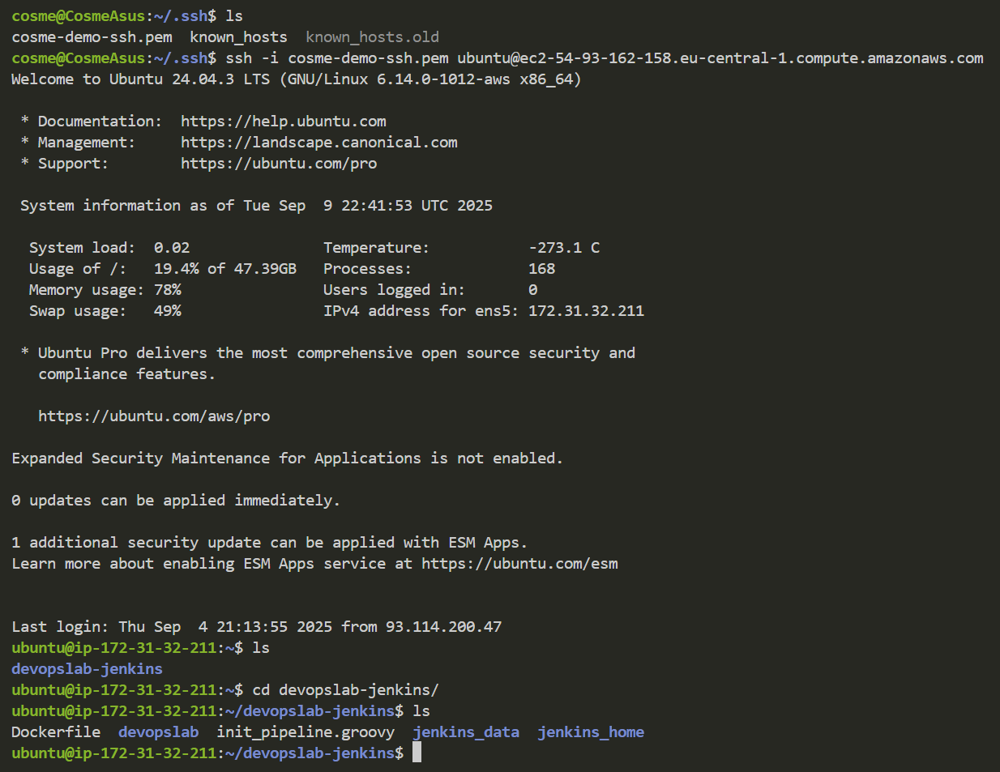

**Jenkins Configuration:**
The EC2 instance hosts a fully configured Jenkins server with:
- Docker, Kubernetes, Kustomize, and Helm installed
- Kind cluster for container orchestration
- Automated pipeline builds for frontend and backend

**Public Access:**
Anonymous users can view and trigger pipelines:

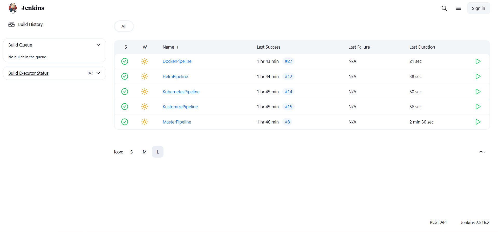

**Admin Dashboard:**
Full administrative control for pipeline configuration:

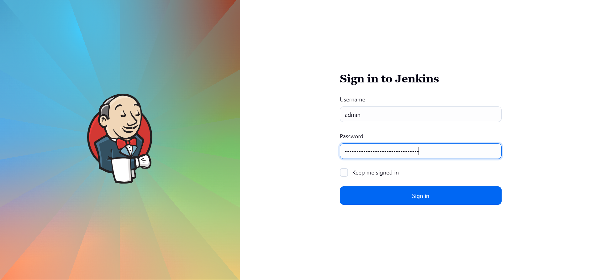

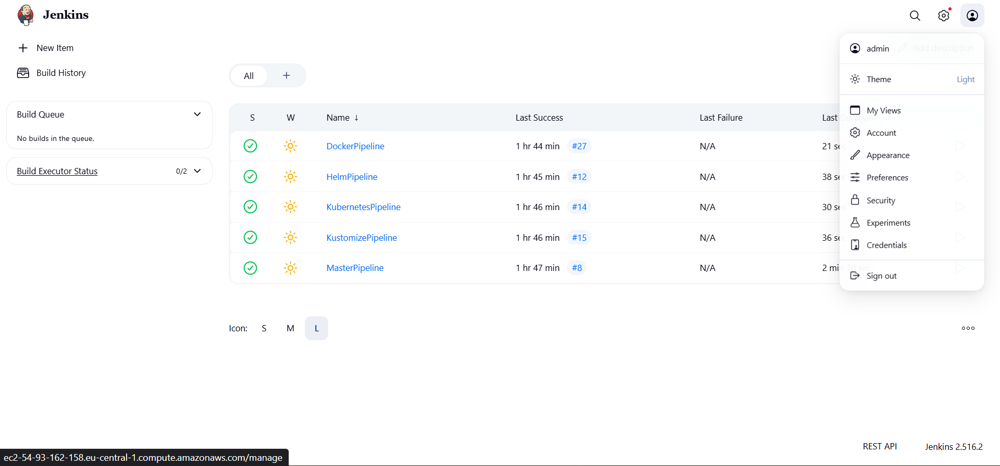

**Security & Permissions:**
Matrix-based security allows anonymous users to view and build pipelines.

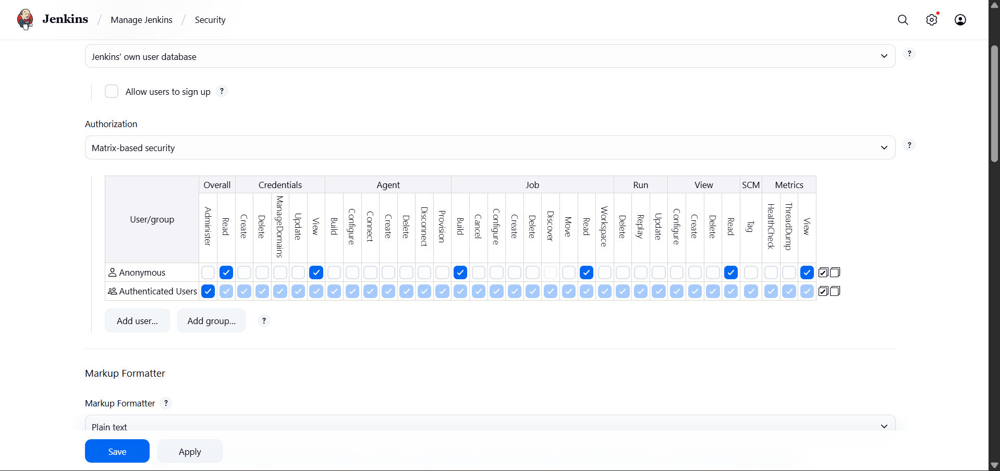

**Storage Expansion:**
Added additional EBS volume since the default 8GB was insufficient for Docker images, Kubernetes clusters, and Jenkins workspace requirements.

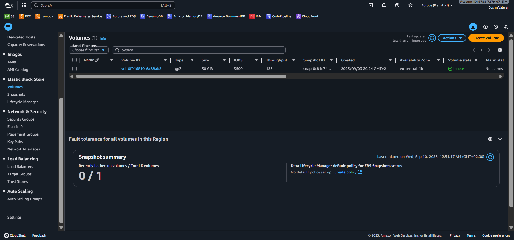

## 💰 Cost Analysis

**Monthly Infrastructure Costs:**
- **S3**: ~$1 (storage and requests)
- **Lambda**: ~$4 (function invocations)
- **EC2**: ~$15 (t3-small instance + EBS volume)
- **Total**: ~$20/month

Currently operating under AWS Free Tier with $200 credit valid for 6 months.

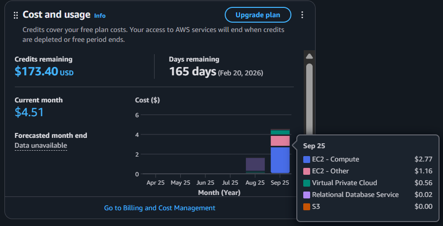

> This architecture demonstrates how to integrate multiple AWS services to create a production-ready CI/CD pipeline with real-time monitoring capabilities.