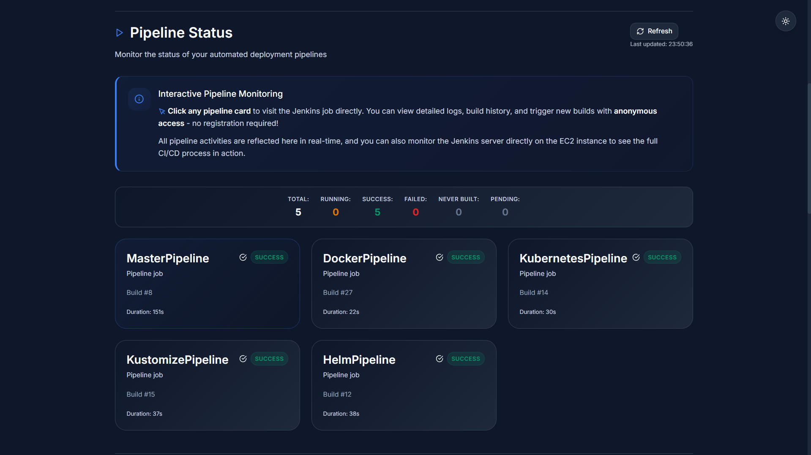

# 🐳🧪 DevOpsLab
Explore different deployment methods, learn through tutorials, and discover CI/CD automation with industry-standard DevOps tools.

## ⚙ Technology Stack
- **Frontend**: React + TypeScript + Vite
- **Backend**: Node.js + Express + TypeScript
- **Containerization**: Docker and Docker Compose
- **Orchestration**: Kubernetes, Kustomize and Helm
- **CI/CD**: Jenkins
- **Cloud Services**:
  - **AWS S3** → Hosting the frontend
  - **AWS Lambda** → Backend API calls
  - **AWS EC2** → Jenkins server

## 🎬 Demo
[Open the AWS S3](https://d3nl9bq5so9qcn.cloudfront.net/) to view the frontend app!

**General Overview:**
*Navigate through the different sections: Introduction, Jenkins pipelines, tutorials, and deployment guides.*


**Interactive Jenkins (AWS S3 + Lambda + EC2):**
*Watch real-time pipeline status updates as Jenkins builds are triggered and monitored through the S3 frontend.*


✨ The most rewarding aspect was integrating AWS S3, Lambda, and EC2 so users could build pipelines on Jenkins, while S3 displayed live pipeline status through Lambda calls to the Jenkins server.

## 🚀 Get Started
Experience DevOpsLab in two ways:

### ☁️ Cloud Version (Recommended):

[Visit the live AWS deployment](https://d3nl9bq5so9qcn.cloudfront.net/). It is fully configured and ready to explore!



> Learn how AWS S3, CloudFront, EC2, Lambda, and IAM were configured to build this cloud architecture [here](./README-aws.md) or in the cloud setup guide.

### 💻 Local Development

Build and run everything on your machine:
```bash
git clone https://github.com/cosmevalera/devopslab

cd devopslab

docker-compose up -d
```
Visit `http://localhost:3000` to see the frontend running. Introduction, tutorials and deployments sections will work immediately.

**Setting up Jenkins integration:**
The Jenkins section requires additional setup. Initially, you'll see connection errors:

*Backend connection required:*


*Jenkins server required:*


Follow the **Jenkins Configuration** section to complete setup. Once configured, you'll have:
- Live pipeline monitoring (like the cloud version)
- Full Jenkins access to create and manage your own pipelines


Unlike the cloud version, local deployment gives you complete Jenkins control to build custom pipelines.

> Check deployment commands for Docker, Kubernetes, Kustomize and Helm [here](./README-command.md) or in the deployments section.